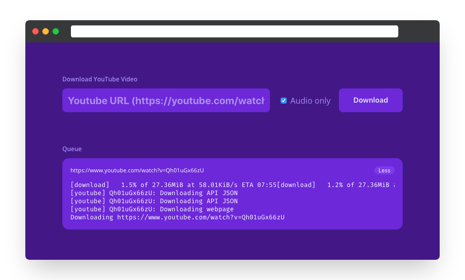

<div align="center">
	<a href="https://mateffy.me/youtube-dl-ui">
		
	</a>
	<h1>youtube-dl-ui</h1>
	<p>
		Basic web UI for youtube-dl. Download a URL in highest quality, choosing between video or audio-only.
	</p>
</div>

<br>

## Installation

```sh
$ npm install -g youtube-dl-ui
```

## Usage

You can now start the server like you would any binary.

```sh
$ youtube-dl-ui
v1.3.0
```

### Options

```
Usage: youtube-dl-ui [options]

Options:
  -V, --version             output the version number
  -p, --port <port>         the port for the http server
  -v, --video-path <path>   path to directory where videos should be saved
  -a, --audio-path <path>   path to directory where audio should be saved
  -s, --socket-path <path>  url path the socket should connect to
  -d, --debug               enable debug mode
  -h, --help                display help for command
```

### Config

#### Environment Variables

The following environment variables can be set, to control `youtube-dl-ui`:

| Environment variable | Type                             | Command-line equivalent         |
| -------------------- | -------------------------------- | ------------------------------- |
| PORT                 | number (e.g. 8080)               | --port 8080                     |
| VIDEO_PATH           | string (e.g. ~/Downloads/videos) | --video-path ~/Downloads/videos |
| AUDIO_PATH           | string (e.g. ~/Downloads/audio)  | --video-path ~/Downloads/audio  |
| SOCKET_PATH          | string (e.g. /socket.io)         | --socket-path /socket.io        |
| DEBUG                | boolean                          | --debug                         |

#### Config file

[RC](https://github.com/dominictarr/rc) is used to look for config files and can be used in the following ways:

- if you passed an option `--config file` then from that file
- `$HOME/.youtube-dl-ui/config`
- `$HOME/.config/youtube-dl-ui`
- `$HOME/.config/youtube-dl-ui/config`
- `/etc/youtube-dl-ui/config`

Settings from this file will be overridden, if you also set options using environment variables or command line arguments.

### Transparent Mode

You can append the query parameter `?transparent=1` to the UI URL. This will remove the colored background and move the content to the left.

This is used in [@capevace/mission-control](https://github.com/capevace/mission-control) to embed the download UI in an iFrame.

Example:

```
https://example.com/youtube-dl-ui?transparent=1
```

## Changelog

### Version 1.3.0

- Added footer which shows current version

### Version 1.2.1

- Fixed SOCKET_PATH env variable not working as intended

### Version 1.2.0

- Added Docker support
- Removed automatic config file creation, you will need to do so yourself now
- Added configuration via environment variables

### Version 1.1.0

- Updated design to fit new version of @capevace/mission-control
- Fixed some socket connection issues

### Version 1.0.3

- Added CLI flag for socket path
- Added config log at startup for verification

### Version 1.0.2

- Changed HTML title

### Version 1.0.1

- Forgot to add README lol

### Version 1.0.0

- First polished release

## Authors

Lukas Mateffy – [@Capevace](https://twitter.com/capevace) – [mateffy.me](https://mateffy.me)

Distributed under the MIT license. See `LICENSE` for more information.

## Contributing

1. Fork it (<https://github.com/capevace/youtube-dl-ui/fork>)
2. Create your feature branch (`git checkout -b feature/fooBar`)
3. Commit your changes (`git commit -am 'Add some fooBar'`)
4. Push to the branch (`git push origin feature/fooBar`)
5. Create a new Pull Request
